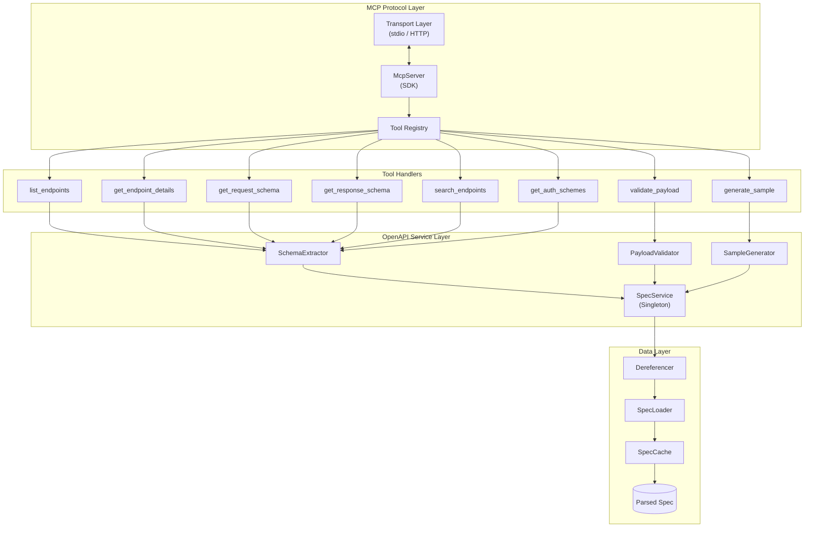
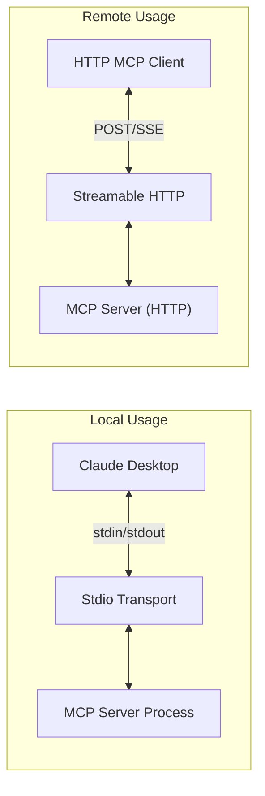
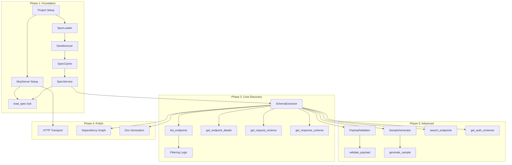

# OpenAPI MCP Server — Technical Architecture & Implementation Plan

> A comprehensive technical specification for building an MCP server that enables LLMs to inspect and interact with OpenAPI specifications.

---

## Table of Contents

1. [Executive Summary](#executive-summary)
2. [Technical Architecture](#technical-architecture)
3. [Core Algorithms](#core-algorithms)
4. [Data Structures](#data-structures)
5. [Implementation Phases](#implementation-phases)
6. [Dependency Graph](#dependency-graph)
7. [Risk Assessment](#risk-assessment)

---

## Executive Summary

### Technology Stack

| Layer | Technology | Purpose |
|-------|-----------|---------|
| **MCP Framework** | `@modelcontextprotocol/sdk` | Server implementation, tool registration, transport handling |
| **Schema Validation** | `zod` | Runtime type validation, tool input schemas |
| **OpenAPI Parsing** | `@apidevtools/swagger-parser` | Spec loading, validation, dereferencing |
| **JSON Schema Validation** | `ajv` | Payload validation against OpenAPI schemas |
| **YAML Support** | `yaml` | YAML spec file parsing |
| **Sample Generation** | `json-schema-faker` | Generate sample payloads from schemas |

### Architecture Principles

1. **Separation of Concerns** — MCP layer handles protocol, OpenAPI layer handles spec logic
2. **Single Load, Multiple Queries** — Parse and cache spec once, serve many tool calls
3. **Deterministic Output** — All responses are fully dereferenced, no `$ref` in output
4. **Fail-Safe Execution** — All errors are caught and returned in MCP-compliant format

---

## Technical Architecture

### System Overview



### Component Responsibilities

| Component | Responsibility |
|-----------|---------------|
| **McpServer** | Initialize server, register tools, handle MCP protocol lifecycle |
| **ToolRegistry** | Map tool names to handlers, validate inputs via Zod schemas |
| **SpecService** | Singleton providing access to parsed, dereferenced OpenAPI spec |
| **SpecLoader** | Fetch spec from URL or file, handle network/file errors |
| **Dereferencer** | Resolve all `$ref` pointers, produce flat schema objects |
| **SchemaExtractor** | Extract endpoints, parameters, request/response schemas |
| **PayloadValidator** | Validate JSON payloads against schemas using AJV |
| **SampleGenerator** | Generate valid sample payloads from JSON Schema |
| **SpecCache** | Store parsed spec, manage TTL-based invalidation |

### Transport Architecture



---

## Core Algorithms

### 1. OpenAPI Spec Loading Algorithm

**Purpose:** Load, validate, and dereference an OpenAPI specification from URL or file.

**Algorithm:**

```
FUNCTION loadSpec(source: URL | FilePath) → ParsedSpec

1. DETERMINE source type (URL vs local file)

2. IF source is URL:
   a. VALIDATE URL format and domain allowlist
   b. FETCH with timeout (10s default)
   c. HANDLE HTTP errors (4xx, 5xx, network)
   d. DETECT content type (JSON vs YAML)
   
3. IF source is file:
   a. VALIDATE path is within allowed directories
   b. READ file contents
   c. DETECT format from extension (.json, .yaml, .yml)

4. PARSE raw content:
   a. IF YAML → parse to JavaScript object
   b. IF JSON → parse to JavaScript object
   
5. VALIDATE against OpenAPI schema:
   a. CHECK required fields (openapi version, info, paths)
   b. VALIDATE structure matches OpenAPI 3.x spec
   c. RETURN validation errors if invalid

6. DEREFERENCE all $ref pointers:
   a. RESOLVE internal references (#/components/schemas/...)
   b. RESOLVE external references (if allowed)
   c. DETECT and BREAK circular references (max depth = 10)
   d. INLINE all referenced schemas

7. BUILD endpoint index:
   a. FOR each path in paths:
      FOR each method in path:
         CREATE EndpointEntry with normalized data
         ADD to endpoint map keyed by "METHOD /path"

8. CACHE result with timestamp

9. RETURN ParsedSpec object

COMPLEXITY: O(n × d) where n = number of schemas, d = reference depth
```

---

### 2. Schema Dereferencing Algorithm

**Purpose:** Recursively resolve all `$ref` pointers to produce flat, inlined schemas.

**Algorithm:**

```
FUNCTION dereference(schema: Schema, context: RefContext, depth: number) → Schema

1. IF depth > MAX_DEPTH (10):
   RETURN { type: "object", description: "[Circular reference]" }

2. IF schema has $ref:
   a. EXTRACT reference path from $ref value
   b. IF path is in visited set → RETURN circular placeholder
   c. ADD path to visited set
   d. RESOLVE target schema from components
   e. MERGE base properties with referenced schema
   f. RECURSE: dereference(resolvedSchema, context, depth + 1)
   g. REMOVE path from visited set
   h. RETURN dereferenced result

3. IF schema.type === "object" AND has properties:
   FOR each property in properties:
      properties[key] = dereference(property, context, depth + 1)

4. IF schema.type === "array" AND has items:
   schema.items = dereference(items, context, depth + 1)

5. IF schema has allOf / anyOf / oneOf:
   FOR each subschema in composition:
      composition[i] = dereference(subschema, context, depth + 1)
   IF allOf → MERGE all subschemas into single schema

6. IF schema has additionalProperties (object):
   additionalProperties = dereference(additionalProperties, context, depth + 1)

7. RETURN schema with all refs resolved

COMPLEXITY: O(n × d) where n = schema node count, d = max nesting depth
```

---

### 3. Endpoint Discovery Algorithm

**Purpose:** List all API endpoints with optional filtering.

**Algorithm:**

```
FUNCTION listEndpoints(filters: FilterOptions) → EndpointList

1. GET cached endpoint index from SpecService

2. INITIALIZE result array

3. FOR each endpoint in index:
   a. CHECK tag filter:
      IF filters.tag AND endpoint.tags NOT CONTAINS tag → SKIP
      
   b. CHECK method filter:
      IF filters.method AND endpoint.method ≠ method → SKIP
      
   c. CHECK deprecated filter:
      IF filters.deprecated = false AND endpoint.deprecated = true → SKIP
      
   d. CHECK keyword filter:
      IF filters.keyword:
         searchText = LOWERCASE(path + summary + description + operationId)
         IF searchText NOT CONTAINS LOWERCASE(keyword) → SKIP
   
   e. ADD to result:
      {
        path: endpoint.path,
        method: endpoint.method,
        operationId: endpoint.operationId,
        summary: endpoint.summary,
        tags: endpoint.tags,
        deprecated: endpoint.deprecated
      }

4. SORT result by path, then by method order (GET, POST, PUT, PATCH, DELETE)

5. IF filters.limit:
   result = result.slice(0, filters.limit)

6. RETURN { endpoints: result, totalCount: result.length }

COMPLEXITY: O(n) where n = number of endpoints
```

---

### 4. Request Schema Extraction Algorithm

**Purpose:** Extract and return the fully dereferenced request body schema for an endpoint.

**Algorithm:**

```
FUNCTION getRequestSchema(path: string, method: string) → RequestSchema

1. NORMALIZE path (ensure leading slash, lowercase method)

2. LOOKUP endpoint in index by key "{METHOD} {path}"
   IF not found → RETURN error "Endpoint not found"

3. GET operation object for endpoint

4. CHECK if requestBody exists:
   IF no requestBody → RETURN { hasBody: false, message: "No request body" }

5. EXTRACT content types from requestBody.content
   PREFER "application/json" over others
   
6. GET media type object for selected content type

7. GET schema from mediaType.schema

8. DEREFERENCE schema (already done if cached):
   schema = dereference(schema)

9. EXTRACT additional metadata:
   - required: requestBody.required
   - description: requestBody.description
   - example: mediaType.example OR schema.example

10. BUILD response:
    {
      contentType: selectedContentType,
      required: isRequired,
      description: description,
      schema: dereferencedSchema,
      example: example (if present)
    }

11. RETURN response

COMPLEXITY: O(1) lookup + O(d) dereferencing if not cached
```

---

### 5. Response Schema Extraction Algorithm

**Purpose:** Extract response schema for a specific endpoint and status code.

**Algorithm:**

```
FUNCTION getResponseSchema(path: string, method: string, statusCode: string) → ResponseSchema

1. NORMALIZE inputs (path, method to lowercase, statusCode as string)

2. LOOKUP endpoint in index
   IF not found → RETURN error

3. GET responses object from operation

4. FIND matching response:
   a. TRY exact match: responses[statusCode]
   b. IF not found, TRY range match: responses["2XX"], responses["4XX"], etc.
   c. IF not found, TRY default: responses["default"]
   d. IF still not found → RETURN error "Status code not found"

5. GET response object

6. CHECK if response has content:
   IF no content → RETURN { hasBody: false, description: response.description }

7. SELECT content type (prefer application/json)

8. GET and DEREFERENCE schema

9. EXTRACT examples:
   a. CHECK mediaType.example
   b. CHECK mediaType.examples (OpenAPI 3.x)
   c. CHECK schema.example
   d. AGGREGATE available examples

10. BUILD response:
    {
      statusCode: statusCode,
      description: response.description,
      contentType: selectedContentType,
      schema: dereferencedSchema,
      examples: examples
    }

11. RETURN response

COMPLEXITY: O(1) lookup + O(d) for dereferencing
```

---

### 6. Payload Validation Algorithm

**Purpose:** Validate a JSON payload against the request schema for an endpoint.

**Algorithm:**

```
FUNCTION validatePayload(path: string, method: string, payload: object) → ValidationResult

1. GET request schema using getRequestSchema(path, method)
   IF error → RETURN error

2. IF no request body schema:
   RETURN { valid: false, error: "Endpoint does not accept a request body" }

3. INITIALIZE AJV validator with options:
   - allErrors: true (collect all errors, not just first)
   - strict: false (allow OpenAPI extensions)
   - formats: include standard formats (email, uri, date-time, etc.)

4. COMPILE schema into validator function
   CACHE compiled validator for reuse

5. EXECUTE validation:
   isValid = validator(payload)

6. IF isValid:
   RETURN { valid: true, errors: [] }

7. IF not valid:
   TRANSFORM AJV errors to user-friendly format:
   FOR each error in validator.errors:
      {
        path: error.instancePath (e.g., "/user/email"),
        message: error.message,
        keyword: error.keyword (e.g., "format", "required", "type"),
        params: error.params (additional context)
      }

8. RETURN { valid: false, errors: transformedErrors }

COMPLEXITY: O(n) where n = size of payload × schema complexity
```

---

### 7. Sample Payload Generation Algorithm

**Purpose:** Generate a valid sample request payload from a JSON Schema.

**Algorithm:**

```
FUNCTION generateSample(schema: JSONSchema, options: GenerateOptions) → SamplePayload

1. IF schema has example:
   RETURN schema.example (prefer explicit examples)

2. SWITCH schema.type:

   CASE "object":
      result = {}
      FOR each property in schema.properties:
         IF property is required OR options.includeOptional:
            result[key] = generateSample(property.schema, options)
      RETURN result

   CASE "array":
      itemSample = generateSample(schema.items, options)
      count = schema.minItems OR 1
      RETURN Array(count).fill(itemSample)

   CASE "string":
      IF schema.enum → RETURN first enum value
      IF schema.format:
         SWITCH format:
            "email" → RETURN "user@example.com"
            "uri" → RETURN "https://example.com"
            "date" → RETURN "2024-01-15"
            "date-time" → RETURN "2024-01-15T10:30:00Z"
            "uuid" → RETURN "550e8400-e29b-41d4-a716-446655440000"
            default → RETURN "string"
      IF schema.pattern → GENERATE matching string (simplified)
      IF schema.minLength → RETURN padded "string"
      RETURN "string"

   CASE "number" / "integer":
      IF schema.enum → RETURN first enum value
      IF schema.minimum → RETURN minimum
      IF schema.maximum → RETURN (minimum + maximum) / 2
      RETURN 0

   CASE "boolean":
      RETURN false

   CASE "null":
      RETURN null

3. IF schema has allOf:
   MERGE samples from all subschemas

4. IF schema has oneOf / anyOf:
   RETURN sample from first subschema

5. RETURN null (fallback)

COMPLEXITY: O(n) where n = number of schema nodes
```

---

### 8. Authentication Scheme Extraction Algorithm

**Purpose:** Extract and organize security schemes and their requirements per endpoint.

**Algorithm:**

```
FUNCTION getAuthSchemes() → AuthSchemeResult

1. GET securitySchemes from spec.components.securitySchemes
   IF not present → RETURN { schemes: [], endpointRequirements: {} }

2. TRANSFORM schemes into normalized format:
   FOR each schemeName, schemeConfig in securitySchemes:
      {
        name: schemeName,
        type: schemeConfig.type,
        scheme: schemeConfig.scheme (for http type),
        bearerFormat: schemeConfig.bearerFormat,
        in: schemeConfig.in (for apiKey),
        parameterName: schemeConfig.name (for apiKey),
        flows: schemeConfig.flows (for oauth2),
        openIdConnectUrl: schemeConfig.openIdConnectUrl,
        description: schemeConfig.description
      }

3. GET global security requirements from spec.security

4. BUILD endpoint requirements map:
   FOR each endpoint in spec.paths:
      key = "{METHOD} {path}"
      
      IF endpoint.security is defined:
         requirements = endpoint.security
      ELSE:
         requirements = globalSecurity
      
      endpointRequirements[key] = EXTRACT scheme names from requirements

5. RETURN {
     schemes: normalizedSchemes,
     globalSecurity: globalSecuritySchemeNames,
     endpointRequirements: endpointRequirements
   }

COMPLEXITY: O(s + e) where s = schemes, e = endpoints
```

---

### 9. Schema Dependency Graph Algorithm

**Purpose:** Build a graph showing which schemas reference which other schemas.

**Algorithm:**

```
FUNCTION buildSchemaGraph(spec: OpenAPISpec) → SchemaGraph

1. INITIALIZE graph = { nodes: {}, edges: [] }

2. FOR each schemaName, schema in spec.components.schemas:
   graph.nodes[schemaName] = {
     name: schemaName,
     usedByEndpoints: [],
     referencedSchemas: [],
     referencedBy: []
   }

3. FOR each schemaName, schema in spec.components.schemas:
   refs = findAllRefs(schema)
   FOR each ref in refs:
      targetName = extractSchemaName(ref)
      graph.nodes[schemaName].referencedSchemas.push(targetName)
      graph.nodes[targetName].referencedBy.push(schemaName)
      graph.edges.push({ from: schemaName, to: targetName })

4. FOR each endpoint in spec.paths:
   schemasUsed = findSchemasUsedByEndpoint(endpoint)
   FOR each schemaName in schemasUsed:
      endpointKey = "{METHOD} {path}"
      graph.nodes[schemaName].usedByEndpoints.push(endpointKey)

5. RETURN graph

HELPER findAllRefs(obj: object) → refs[]:
   refs = []
   IF obj.$ref:
      refs.push(obj.$ref)
   FOR each value in Object.values(obj):
      IF typeof value === "object":
         refs = refs.concat(findAllRefs(value))
   RETURN refs

COMPLEXITY: O(n × d) where n = schema count, d = average schema depth
```

---

### 10. Spec Caching Algorithm

**Purpose:** Cache parsed specs with TTL-based invalidation and refresh capability.

**Algorithm:**

```
CLASS SpecCache:
   cache: Map<string, CacheEntry>
   
   STRUCT CacheEntry:
      spec: ParsedSpec
      loadedAt: timestamp
      ttlMs: number
      source: string

FUNCTION get(key: string) → ParsedSpec | null
   entry = cache.get(key)
   IF entry is null → RETURN null
   
   IF isExpired(entry):
      IF autoRefreshEnabled:
         SCHEDULE backgroundRefresh(key, entry.source)
      RETURN entry.spec (serve stale while refreshing)
   
   RETURN entry.spec

FUNCTION set(key: string, spec: ParsedSpec, source: string, ttlMs: number)
   entry = {
      spec: spec,
      loadedAt: Date.now(),
      ttlMs: ttlMs,
      source: source
   }
   cache.set(key, entry)

FUNCTION isExpired(entry: CacheEntry) → boolean
   RETURN Date.now() > entry.loadedAt + entry.ttlMs

FUNCTION invalidate(key: string)
   cache.delete(key)

FUNCTION backgroundRefresh(key: string, source: string)
   TRY:
      newSpec = await loadSpec(source)
      set(key, newSpec, source, defaultTtl)
   CATCH:
      LOG error, keep stale entry
```

---

## Data Structures

### Core Types

```
TYPE ParsedSpec:
   raw: OpenAPIDocument           // Original parsed document
   version: string                // "3.0.0", "3.1.0"
   info: SpecInfo                 // Title, description, version
   servers: Server[]              // Available API servers
   endpoints: Map<string, Endpoint>  // Keyed by "METHOD /path"
   schemas: Map<string, Schema>   // Dereferenced component schemas
   securitySchemes: SecurityScheme[]
   loadedAt: timestamp

TYPE Endpoint:
   path: string                   // "/users/{id}"
   method: HttpMethod             // "GET", "POST", etc.
   operationId: string | null
   summary: string
   description: string
   tags: string[]
   deprecated: boolean
   parameters: Parameter[]
   requestBody: RequestBody | null
   responses: Map<string, Response>
   security: SecurityRequirement[]

TYPE Parameter:
   name: string
   in: "path" | "query" | "header" | "cookie"
   required: boolean
   schema: Schema                 // Dereferenced
   description: string
   example: any

TYPE RequestBody:
   required: boolean
   description: string
   content: Map<string, MediaType>

TYPE MediaType:
   schema: Schema                 // Dereferenced
   example: any
   examples: Map<string, Example>

TYPE Schema:
   // Standard JSON Schema properties, fully dereferenced
   type: string
   properties: Map<string, Schema>
   items: Schema
   required: string[]
   enum: any[]
   format: string
   // ... all JSON Schema keywords
```

### MCP Response Types

```
TYPE ToolResponse<T>:
   success: boolean
   data?: T
   error?: string
   code?: string

TYPE ListEndpointsResponse:
   endpoints: EndpointSummary[]
   totalCount: number

TYPE EndpointSummary:
   path: string
   method: string
   operationId: string | null
   summary: string
   tags: string[]
   deprecated: boolean

TYPE SchemaResponse:
   contentType: string
   required: boolean
   schema: Schema
   example?: any

TYPE ValidationResponse:
   valid: boolean
   errors: ValidationError[]

TYPE ValidationError:
   path: string               // JSON pointer path
   message: string
   keyword: string            // JSON Schema keyword that failed
   params: object             // Additional context
```

---

## Implementation Phases

### Phase 1: Foundation (Week 1)
**Goal:** Basic MCP server with spec loading

| Task | Description | Dependencies |
|------|-------------|--------------|
| 1.1 | Project setup (TypeScript, ESLint, Vitest) | None |
| 1.2 | Implement SpecLoader (URL + file support) | 1.1 |
| 1.3 | Implement Dereferencer with circular ref handling | 1.2 |
| 1.4 | Implement SpecCache with TTL | 1.3 |
| 1.5 | Create SpecService singleton | 1.4 |
| 1.6 | Setup McpServer with stdio transport | 1.1 |
| 1.7 | Implement `load_spec` tool | 1.5, 1.6 |

**Deliverable:** Server can load and cache an OpenAPI spec via MCP tool call.

---

### Phase 2: Core Discovery (Week 2)
**Goal:** Endpoint discovery and schema retrieval

| Task | Description | Dependencies |
|------|-------------|--------------|
| 2.1 | Implement SchemaExtractor | Phase 1 |
| 2.2 | Implement `list_endpoints` tool | 2.1 |
| 2.3 | Implement `get_endpoint_details` tool | 2.1 |
| 2.4 | Implement `get_request_schema` tool | 2.1 |
| 2.5 | Implement `get_response_schema` tool | 2.1 |
| 2.6 | Add endpoint filtering (tag, method, deprecated) | 2.2 |
| 2.7 | Unit tests for all extraction logic | 2.1-2.6 |

**Deliverable:** LLM can discover and inspect all endpoints and schemas.

---

### Phase 3: Advanced Features (Week 3)
**Goal:** Validation, generation, and search

| Task | Description | Dependencies |
|------|-------------|--------------|
| 3.1 | Implement PayloadValidator with AJV | Phase 2 |
| 3.2 | Implement `validate_payload` tool | 3.1 |
| 3.3 | Implement SampleGenerator | Phase 2 |
| 3.4 | Implement `generate_sample` tool | 3.3 |
| 3.5 | Implement `search_endpoints` tool | Phase 2 |
| 3.6 | Implement `get_auth_schemes` tool | Phase 2 |
| 3.7 | Implement `get_servers` tool | Phase 2 |

**Deliverable:** Full feature set for schema intelligence.

---

### Phase 4: Polish & Extensions (Week 4)
**Goal:** Production readiness

| Task | Description | Dependencies |
|------|-------------|--------------|
| 4.1 | Add Streamable HTTP transport | Phase 1-3 |
| 4.2 | Implement schema dependency graph | Phase 2 |
| 4.3 | Add markdown documentation generation | Phase 2 |
| 4.4 | Comprehensive error handling review | All |
| 4.5 | Performance optimization (lazy loading) | All |
| 4.6 | Integration tests with real OpenAPI specs | All |
| 4.7 | Documentation and examples | All |

**Deliverable:** Production-ready MCP server.

---

## Dependency Graph



---

## Risk Assessment

| Risk | Impact | Probability | Mitigation |
|------|--------|-------------|------------|
| Circular `$ref` causing infinite loops | High | Medium | Max depth limit (10), visited set tracking |
| Large specs causing memory issues | Medium | Medium | Lazy loading, streaming where possible |
| Invalid OpenAPI specs failing silently | Medium | High | Comprehensive validation on load |
| Network failures when fetching remote specs | Medium | Medium | Retry logic, timeout, clear error messages |
| AJV validation edge cases | Low | Medium | Extensive test suite with edge cases |
| Breaking changes in MCP SDK | Medium | Low | Pin dependency versions, monitor releases |

---

## Verification Plan

### Automated Testing

1. **Unit Tests**
   - SpecLoader: URL fetch, file read, error handling
   - Dereferencer: Simple refs, nested refs, circular refs
   - SchemaExtractor: All extraction methods
   - PayloadValidator: Valid/invalid payloads, edge cases
   - SampleGenerator: All schema types

2. **Integration Tests**
   - Load real-world OpenAPI specs (Petstore, Stripe, GitHub)
   - End-to-end tool call scenarios
   - Error handling paths

3. **MCP Compliance**
   - Test with Claude Desktop
   - Test with MCP Inspector
   - Verify response format compliance

### Manual Verification

1. Load complex production API specs
2. Validate sample generation produces valid payloads
3. Test with various LLM clients

---

> [!NOTE]
> This implementation plan prioritizes a working MVP in the first two phases, with advanced features added incrementally. Each phase builds on the previous, with clear deliverables and testable milestones.
