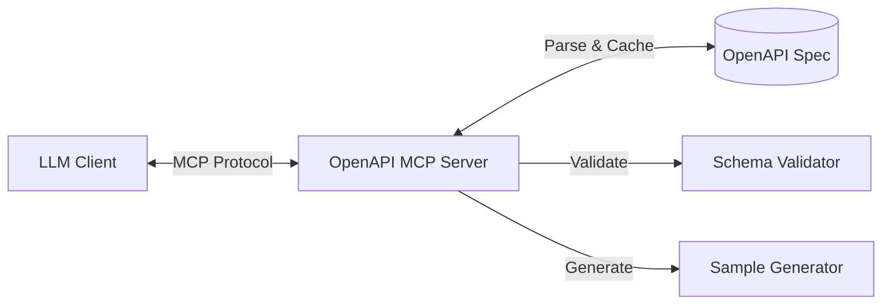
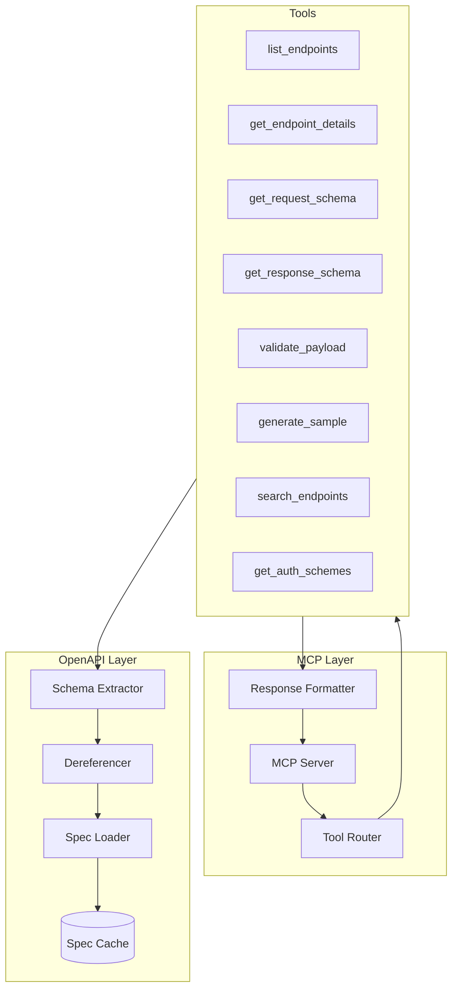

# OpenAPI MCP Server

> A Model Context Protocol (MCP) server that enables LLMs to inspect, reason about, and interact with OpenAPI specifications.

[](https://www.typescriptlang.org/)
[](https://modelcontextprotocol.io/)
[](LICENSE)

---

## Table of Contents

- [Overview](#overview)
- [Quick Start](#quick-start)
- [Architecture](#architecture)
- [Features](#features)
- [Tech Stack](#tech-stack)
- [Coding Guidelines](#coding-guidelines)
- [API Reference](#api-reference)
- [Roadmap](#roadmap)
- [Acceptance Criteria](#acceptance-criteria)

---

## Overview

This MCP server provides structured tooling for LLMs to:

- **Load & Parse** OpenAPI/Swagger specifications from URLs or local files
- **Discover** API endpoints with rich metadata
- **Inspect** request/response schemas in fully dereferenced form
- **Validate** payloads against schemas
- **Generate** sample requests and documentation



---

## Quick Start

### Prerequisites

- Node.js 18+ 
- npm or pnpm
- An OpenAPI 3.x specification (URL or local file)

### Installation

```bash
# Clone the repository
git clone https://github.com/your-org/openapi-mcp.git
cd openapi-mcp

# Install dependencies
npm install

# Build the project
npm run build

# Start the server
npm start
```

### Configuration

Create a `.env` file or set environment variables:

```env
# OpenAPI spec source (URL or file path)
OPENAPI_SPEC_URL=https://api.example.com/openapi.json

# Optional: Local file fallback
OPENAPI_SPEC_PATH=./specs/openapi.yaml

# Server configuration
MCP_SERVER_PORT=3000
LOG_LEVEL=info

# Cache settings
CACHE_TTL_SECONDS=3600
AUTO_REFRESH_ENABLED=false
```

### Usage with Claude Desktop

Add to your Claude Desktop configuration (`claude_desktop_config.json`):

```json
{
  "mcpServers": {
    "openapi": {
      "command": "node",
      "args": ["/path/to/openapi-mcp/dist/index.js"],
      "env": {
        "OPENAPI_SPEC_URL": "https://api.example.com/openapi.json"
      }
    }
  }
}
```

---

## Architecture

### System Design



### Directory Structure

```
openapi-mcp/
├── src/
│   ├── index.ts              # Entry point
│   ├── server/               # MCP server logic
│   │   ├── mcp-server.ts     # Server initialization
│   │   ├── tool-router.ts    # Tool request routing
│   │   └── response.ts       # Response formatting
│   ├── openapi/              # OpenAPI handling layer
│   │   ├── loader.ts         # Spec loading (URL/file)
│   │   ├── dereferencer.ts   # $ref resolution
│   │   ├── validator.ts      # Spec validation
│   │   ├── cache.ts          # Caching logic
│   │   └── extractor.ts      # Schema extraction
│   ├── tools/                # Tool implementations
│   │   ├── list-endpoints.ts
│   │   ├── get-endpoint.ts
│   │   ├── get-request-schema.ts
│   │   ├── get-response-schema.ts
│   │   ├── validate-payload.ts
│   │   ├── generate-sample.ts
│   │   ├── search-endpoints.ts
│   │   └── get-auth-schemes.ts
│   ├── types/                # TypeScript interfaces
│   │   ├── openapi.ts
│   │   ├── mcp.ts
│   │   └── tools.ts
│   └── utils/                # Shared utilities
│       ├── logger.ts
│       ├── errors.ts
│       └── helpers.ts
├── tests/                    # Test suites
├── specs/                    # Sample OpenAPI specs
├── docs/                     # Additional documentation
└── package.json
```

---

## Features

### Core Features

#### 1. OpenAPI Specification Loading

| Capability | Description |
|------------|-------------|
| **URL Loading** | Fetch specs from remote Swagger/OpenAPI URLs |
| **File Loading** | Load local JSON/YAML specification files |
| **Validation** | Validate spec structure against OpenAPI schema |
| **Dereferencing** | Fully resolve all `$ref` definitions |
| **Caching** | Cache parsed specs to avoid repeated fetching |
| **Auto-refresh** | Optionally refresh specs on a configurable interval |

#### 2. Endpoint Discovery

List all API endpoints with rich metadata:

```json
{
  "success": true,
  "data": {
    "endpoints": [
      {
        "path": "/users/{id}",
        "method": "GET",
        "operationId": "getUserById",
        "summary": "Get a user by ID",
        "description": "Retrieves detailed user information",
        "tags": ["Users"],
        "deprecated": false
      }
    ],
    "totalCount": 42
  }
}
```

#### 3. Endpoint Detail Inspection

Retrieve comprehensive endpoint details:

- Operation metadata (summary, description, tags)
- Path parameters with types and validation rules
- Query parameters with defaults and enums
- Header requirements
- Request body schema (fully dereferenced)
- All response codes with schemas
- Security requirements

#### 4. Request Schema Retrieval

Extract and return fully dereferenced request body schemas:

```json
{
  "success": true,
  "data": {
    "contentType": "application/json",
    "schema": {
      "type": "object",
      "required": ["name", "email"],
      "properties": {
        "name": { "type": "string", "minLength": 1, "maxLength": 100 },
        "email": { "type": "string", "format": "email" }
      }
    }
  }
}
```

#### 5. Response Schema Retrieval

Get response schemas by status code, including examples:

```json
{
  "success": true,
  "data": {
    "statusCode": "200",
    "description": "Successful response",
    "contentType": "application/json",
    "schema": { /* ... */ },
    "example": { "id": 1, "name": "John Doe" }
  }
}
```

---

### Advanced Features

#### 6. Endpoint Search & Filtering

Search endpoints by various criteria:

| Filter | Description | Example |
|--------|-------------|---------|
| `tag` | Filter by OpenAPI tag | `"Users"` |
| `method` | Filter by HTTP method | `"POST"` |
| `keyword` | Search in path, summary, description | `"authentication"` |
| `deprecated` | Include/exclude deprecated endpoints | `false` |

#### 7. Sample Payload Generation

Generate valid sample request payloads from schemas:

```json
{
  "success": true,
  "data": {
    "sample": {
      "name": "string",
      "email": "user@example.com",
      "age": 0,
      "preferences": {
        "newsletter": true
      }
    }
  }
}
```

#### 8. Payload Validation

Validate payloads against endpoint schemas:

```json
{
  "success": true,
  "data": {
    "valid": false,
    "errors": [
      {
        "path": "/email",
        "message": "must match format \"email\"",
        "keyword": "format"
      }
    ]
  }
}
```

#### 9. Authentication Schema Extraction

Parse and explain security schemes:

```json
{
  "success": true,
  "data": {
    "schemes": [
      {
        "name": "bearerAuth",
        "type": "http",
        "scheme": "bearer",
        "bearerFormat": "JWT",
        "description": "JWT token authentication"
      },
      {
        "name": "apiKey",
        "type": "apiKey",
        "in": "header",
        "parameterName": "X-API-Key"
      }
    ],
    "endpointRequirements": {
      "POST /users": ["bearerAuth"],
      "GET /public/status": []
    }
  }
}
```

#### 10. Server & Environment Discovery

List available API servers and base URLs:

```json
{
  "success": true,
  "data": {
    "servers": [
      {
        "url": "https://api.example.com/v1",
        "description": "Production server",
        "variables": {}
      },
      {
        "url": "https://staging-api.example.com/v1", 
        "description": "Staging environment"
      }
    ]
  }
}
```

#### 11. Schema Dependency Graph

Visualize relationships between schemas:

```json
{
  "success": true,
  "data": {
    "schemas": {
      "User": {
        "usedBy": ["GET /users/{id}", "POST /users", "PUT /users/{id}"],
        "references": ["Address", "Role"]
      },
      "Address": {
        "usedBy": [],
        "referencedBy": ["User", "Company"]
      }
    }
  }
}
```

#### 12. Documentation Generation

Generate human-readable markdown documentation:

```json
{
  "success": true,
  "data": {
    "format": "markdown",
    "content": "# Users API\n\n## GET /users/{id}\n\nRetrieves a user by their unique identifier...",
    "sections": ["overview", "authentication", "endpoints", "schemas"]
  }
}
```

---

### Future Features (Planned)

| Feature | Description | Priority |
|---------|-------------|----------|
| **Live API Execution** | Execute real API calls with schema validation | High |
| **Multi-Spec Support** | Load and switch between multiple specs | High |
| **Breaking Change Detection** | Compare spec versions, identify incompatibilities | Medium |
| **Code Generation** | Generate TypeScript types/clients from spec | Medium |
| **Webhook Support** | Handle OpenAPI 3.1 webhook definitions | Medium |
| **Rate Limit Awareness** | Parse and respect `x-rateLimit` extensions | Low |
| **GraphQL Schema Export** | Convert OpenAPI to GraphQL schema | Low |

---

## Tech Stack

### Core Dependencies

| Package | Purpose |
|---------|---------|
| `@modelcontextprotocol/sdk` | MCP server implementation |
| `@apidevtools/swagger-parser` | OpenAPI parsing & dereferencing |
| `ajv` | JSON Schema validation |
| `yaml` | YAML parsing support |
| `zod` | Runtime type validation |

### Development Dependencies

| Package | Purpose |
|---------|---------|
| `typescript` | Static typing |
| `vitest` | Testing framework |
| `eslint` | Code linting |
| `prettier` | Code formatting |
| `tsx` | TypeScript execution |

---

## Coding Guidelines

### General Principles

- ✅ Code should be **modular**, **readable**, and **testable**
- ✅ Use **TypeScript** with strict mode enabled
- ✅ Maintain clear separation between MCP and OpenAPI layers
- ✅ Prioritize **deterministic, structured**, machine-readable output
- ✅ Follow single-responsibility principle for modules

### Naming Conventions

| Type | Convention | Example |
|------|------------|---------|
| Variables/Functions | camelCase | `getRequestSchema`, `endpointList` |
| Types/Interfaces | PascalCase | `EndpointDetails`, `SchemaResponse` |
| Constants | UPPER_SNAKE_CASE | `DEFAULT_CACHE_TTL`, `MAX_RETRIES` |
| Files | kebab-case | `get-endpoint.ts`, `spec-loader.ts` |

### TypeScript Rules

```typescript
// ✅ Good: Strongly typed with interfaces
interface EndpointDetails {
  path: string;
  method: HttpMethod;
  operationId?: string;
  summary: string;
  parameters: Parameter[];
}

// ❌ Bad: Using `any`
function getEndpoint(path: string): any { /* ... */ }

// ✅ Good: Proper error handling
function getEndpoint(path: string): Result<EndpointDetails, ApiError> { /* ... */ }
```

### Error Handling

All errors must follow MCP conventions:

```typescript
// Standard error response
interface ErrorResponse {
  success: false;
  error: string;
  code?: string;
  context?: {
    path?: string;
    method?: string;
    details?: unknown;
  };
}

// Example
{
  "success": false,
  "error": "Endpoint not found",
  "code": "ENDPOINT_NOT_FOUND",
  "context": {
    "path": "/unknown/path",
    "method": "GET"
  }
}
```

### Response Format

All tool responses must follow this structure:

```typescript
interface ToolResponse<T> {
  success: boolean;
  data?: T;
  error?: string;
  code?: string;
  context?: Record<string, unknown>;
}
```

### Performance Guidelines

- 📦 Load and dereference OpenAPI spec once on startup
- 🗄️ Cache parsed results and reuse across tool calls
- ⚡ Use lazy loading and memoization for expensive operations
- 🔄 Implement smart cache invalidation for auto-refresh

### Security Considerations

> [!CAUTION]
> Security is critical when handling external specifications.

- 🔒 Validate all URLs before fetching (allowlist domains if needed)
- 🔒 Prevent path traversal in file loading
- 🔒 Sanitize all dynamic inputs in tool handlers
- 🔒 Never execute arbitrary code from specifications
- 🔒 Implement request timeouts for URL fetching

### Documentation Standards

- Use JSDoc/TSDoc for all exported functions
- Provide module-level descriptions
- Document tool parameters with examples
- Include inline comments for complex logic

```typescript
/**
 * Retrieves the request body schema for a specific endpoint.
 * 
 * @param path - The API path (e.g., "/users/{id}")
 * @param method - The HTTP method (e.g., "POST")
 * @returns Fully dereferenced request schema or error
 * 
 * @example
 * const schema = await getRequestSchema("/users", "POST");
 * // Returns: { type: "object", properties: { ... } }
 */
export async function getRequestSchema(
  path: string,
  method: HttpMethod
): Promise<Result<RequestSchema, ApiError>> {
  // Implementation
}
```

---

## API Reference

### Available Tools

| Tool | Description | Parameters |
|------|-------------|------------|
| `load_spec` | Load an OpenAPI specification | `url`, `filePath` |
| `list_endpoints` | List all API endpoints | `tag?`, `method?`, `deprecated?` |
| `search_endpoints` | Search endpoints by keyword | `query`, `limit?` |
| `get_endpoint_details` | Get details for a specific endpoint | `path`, `method` |
| `get_request_schema` | Get request body schema | `path`, `method` |
| `get_response_schema` | Get response schema | `path`, `method`, `statusCode` |
| `validate_payload` | Validate a payload against schema | `path`, `method`, `payload` |
| `generate_sample` | Generate sample request payload | `path`, `method` |
| `get_auth_schemes` | Get authentication schemes | — |
| `get_servers` | Get available API servers | — |
| `get_schema_graph` | Get schema dependency graph | `schemaName?` |
| `generate_docs` | Generate markdown documentation | `sections?` |

### Tool Examples

#### list_endpoints

```json
// Request
{ "tool": "list_endpoints", "arguments": { "tag": "Users", "method": "GET" } }

// Response
{
  "success": true,
  "data": {
    "endpoints": [
      { "path": "/users", "method": "GET", "summary": "List all users" },
      { "path": "/users/{id}", "method": "GET", "summary": "Get user by ID" }
    ],
    "totalCount": 2
  }
}
```

#### get_request_schema

```json
// Request
{ "tool": "get_request_schema", "arguments": { "path": "/users", "method": "POST" } }

// Response
{
  "success": true,
  "data": {
    "contentType": "application/json",
    "required": true,
    "schema": {
      "type": "object",
      "required": ["name", "email"],
      "properties": {
        "name": { "type": "string" },
        "email": { "type": "string", "format": "email" }
      }
    }
  }
}
```

#### validate_payload

```json
// Request
{
  "tool": "validate_payload",
  "arguments": {
    "path": "/users",
    "method": "POST",
    "payload": { "name": "John", "email": "invalid-email" }
  }
}

// Response
{
  "success": true,
  "data": {
    "valid": false,
    "errors": [
      { "path": "/email", "message": "must match format \"email\"" }
    ]
  }
}
```

---

## Roadmap

### Phase 1: MVP ✅
- [ ] OpenAPI spec loading (URL + file)
- [ ] Full dereferencing of `$ref`
- [ ] Endpoint listing
- [ ] Endpoint detail retrieval
- [ ] Request schema extraction
- [ ] Response schema extraction
- [ ] MCP tool integration

### Phase 2: Enhanced Discovery
- [ ] Endpoint search & filtering
- [ ] Tag-based grouping
- [ ] Authentication scheme extraction
- [ ] Server/environment discovery

### Phase 3: Schema Intelligence  
- [ ] Sample payload generation
- [ ] Payload validation
- [ ] Schema dependency graph
- [ ] Documentation generation

### Phase 4: Advanced Features
- [ ] Multi-spec support
- [ ] Breaking change detection
- [ ] Live API execution
- [ ] TypeScript code generation

---

## Acceptance Criteria

### MVP Requirements

A working MVP must satisfy all of the following:

| # | Requirement | Validation |
|---|-------------|------------|
| 1 | Load OpenAPI spec from URL | `load_spec({ url: "https://..." })` returns success |
| 2 | Load OpenAPI spec from file | `load_spec({ filePath: "./spec.yaml" })` returns success |
| 3 | List all endpoints | `list_endpoints()` returns array of endpoints |
| 4 | Get endpoint details | `get_endpoint_details({ path, method })` returns full operation |
| 5 | Get request schema | `get_request_schema({ path, method })` returns dereferenced schema |
| 6 | Get response schema | `get_response_schema({ path, method, statusCode })` returns schema |
| 7 | No unresolved refs | All returned schemas contain no `$ref` values |
| 8 | Consistent responses | All tools return `{ success, data?, error? }` format |
| 9 | Error handling | Invalid inputs return meaningful error messages |
| 10 | MCP compatibility | Server works with Claude Desktop / MCP clients |

### Test Scenarios

```gherkin
Feature: OpenAPI Spec Loading
  Scenario: Load valid spec from URL
    Given a valid OpenAPI spec at "https://petstore.swagger.io/v2/swagger.json"
    When I call load_spec with the URL
    Then the response should have success = true
    And the spec should be cached

  Scenario: Load invalid spec
    Given an invalid OpenAPI spec
    When I call load_spec
    Then the response should have success = false
    And error should contain "Invalid OpenAPI specification"

Feature: Endpoint Discovery
  Scenario: List endpoints with filter
    Given a loaded spec with 50 endpoints
    When I call list_endpoints with tag = "Users"
    Then only endpoints tagged "Users" should be returned

Feature: Schema Retrieval
  Scenario: Get fully dereferenced schema
    Given an endpoint with nested $ref schemas
    When I call get_request_schema
    Then the returned schema should have no $ref values
    And all nested objects should be fully expanded
```

---

## Contributing

1. Fork the repository
2. Create a feature branch (`git checkout -b feature/amazing-feature`)
3. Commit your changes (`git commit -m 'Add amazing feature'`)
4. Push to the branch (`git push origin feature/amazing-feature`)
5. Open a Pull Request

---

## License

This project is licensed under the MIT License - see the [LICENSE](LICENSE) file for details.

---

<p align="center">
  Built with ❤️ for the MCP ecosystem
</p>
